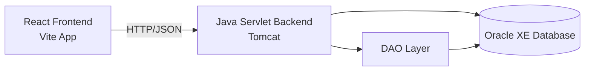
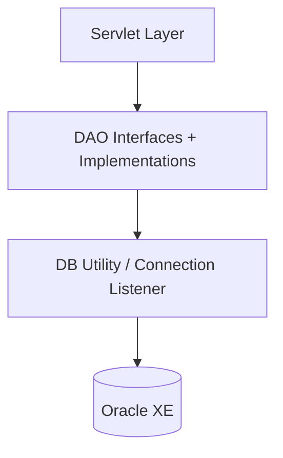

# KrishiMandal - SIH 2024

KrishiMandal is a farmer-first digital platform built during Smart India Hackathon (SIH) 2024.  
The goal is to support farmers with one integrated system for agri marketplace, equipment renting, jobs, land collaboration, and practical decision support.

## Project Theme

Empowering farmers through a unified agri ecosystem:

- Buy/Sell farm products
- Rent agricultural tools/equipment
- Job posting and job applications
- Land collaboration/renting workflows
- Farmer profile and order management
- Utility modules such as weather, mandi, guidance, and community-facing pages

## Repository Structure

This workspace contains two projects:

1. `KrishiMandal/` - Java backend (Servlets, Tomcat, Oracle DB)
2. `Krishi Mandal-frontend/` - React frontend (Vite + Tailwind)

## Why We Built This

Indian farmers often use separate, disconnected channels for selling produce, finding labor, renting equipment, and accessing advisory information.  
KrishiMandal combines these flows in one system to reduce friction, improve market access, and make daily agricultural decisions easier.

## Core Functionalities

- Authentication (`LoginServlet`, `SignUpServlet`)
- Product listing and product browsing (`ProductsServlet`, `ProductsListServlet`)
- Purchase and order management (`PurchaseServlet`, `OrderServlet`, `OrderDetailsServlet`)
- Job board and applications (`JobServlet`, `JobApplicationServlet`, `MyApplicationServlet`)
- Land collaboration (`LandCollabServlet`)
- Farmer profile management (`ProfileServlet`)

Frontend pages include marketplace, product listing, jobs, weather, guidance, schemes/subsidies, mandi price, community, and more.

## Tech Stack

### Backend

- Java 8
- Java Servlet (J2EE Web)
- Apache Tomcat
- Oracle Database (XE)
- Ant/NetBeans project
- JSON libraries: `org.json`, `gson`
- Mail libraries: `javax.mail`, `activation`

### Frontend

- React 18
- Vite 5
- Tailwind CSS
- Axios
- React Router
- Lucide React icons
- Firebase (as configured in frontend)

## High-Level Architecture



## Backend Module View



## Prerequisites

- JDK 8
- NetBeans (Ant web project support)
- Apache Tomcat 8/9 (configured in NetBeans)
- Oracle XE running locally
- Node.js 18+ (recommended) for frontend

## How to Run

### 1) Run Backend (`KrishiMandal`)

1. Open `KrishiMandal` in NetBeans.
2. Ensure Java platform is JDK 8.
3. Configure Tomcat server in NetBeans.
4. Verify DB config in `KrishiMandal/web/WEB-INF/web.xml`:
   - URL: `jdbc:oracle:thin:@localhost:1521/xe`
   - username/password according to your local Oracle schema.
5. Keep required jars in `KrishiMandal/web/WEB-INF/lib` (already added in this project).
6. Clean and Build, then Run.

### 2) Run Frontend (`Krishi Mandal-frontend`)

```bash
cd "Krishi Mandal-frontend"
npm install
npm run dev
```

Default Vite URL is typically `http://localhost:5173`.

## SIH 2024 Context

This project is developed as an SIH 2024 solution focused on farmer support through digital integration of commerce, collaboration, and services in agriculture.
